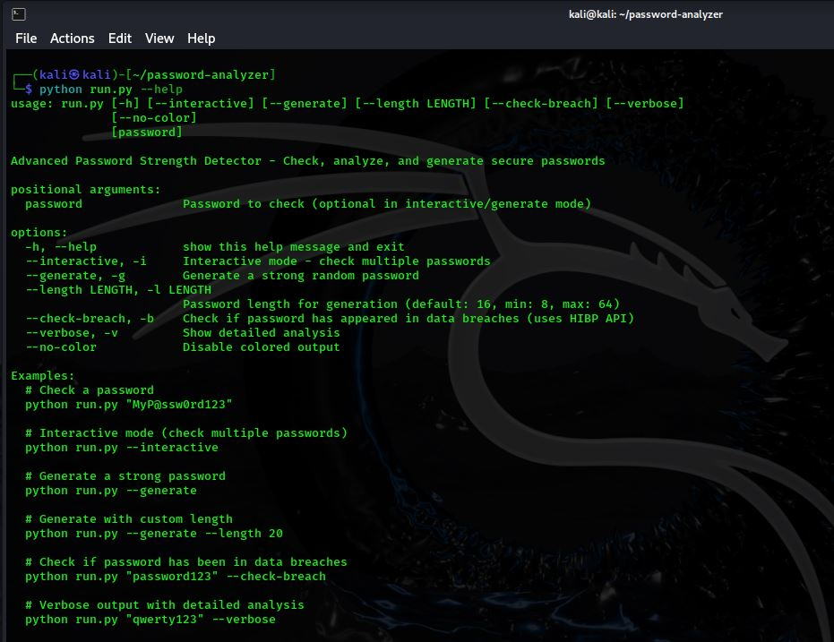
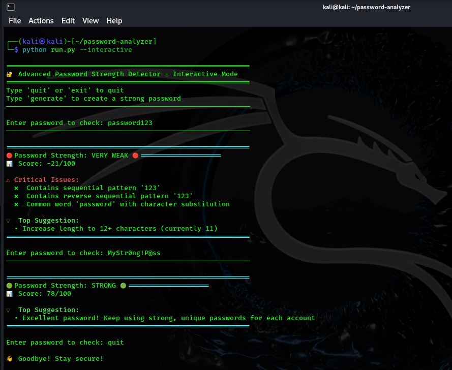
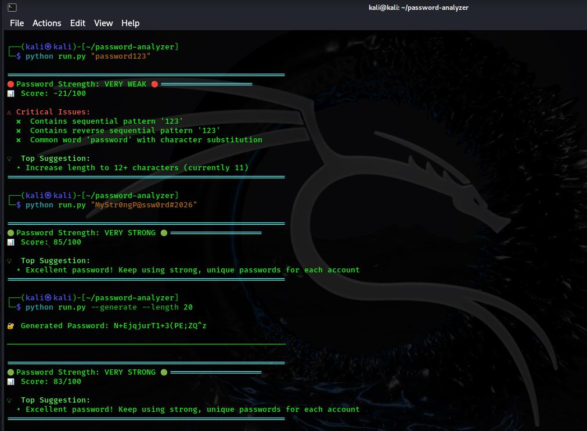
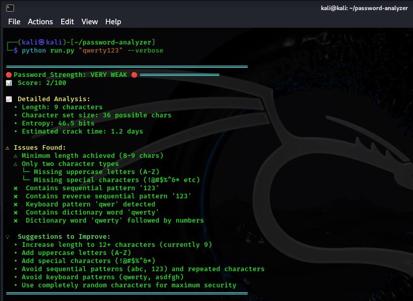
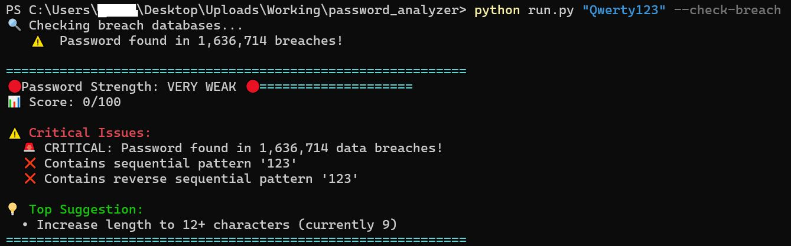

# Password Strength Detector

Advanced password security analyzer with breach checking, entropy calculation, and pattern detection.

## Features

- **Score passwords** (0-100) with risk levels
- **Check breaches** via Have I Been Pwned API
- **Detect patterns** (keyboard walks, sequences, dates)
- **Dictionary checks** (10k+ common passwords)
- **Entropy calculation** with crack time estimates
- **Generate secure passwords** (cryptographically random)
- **Interactive mode** for multiple checks

## Screenshots

### Help Menu


### Interactive Mode


### Password Analysis


### Verbose Analysis


### Breach Detection


## Quick Start

```bash
# Install
pip install -r requirements.txt

# Check a password
python run.py "YourPassword123!"

# Generate strong password
python run.py --generate

# Interactive mode
python run.py --interactive

# Check against breaches
python run.py "password123" --check-breach

```
## Usage Examples
```
python run.py "qwerty123" --verbose
python run.py --generate --length 20
python run.py --interactive --check-breach
```
## Author
Prasad

## License
MIT
